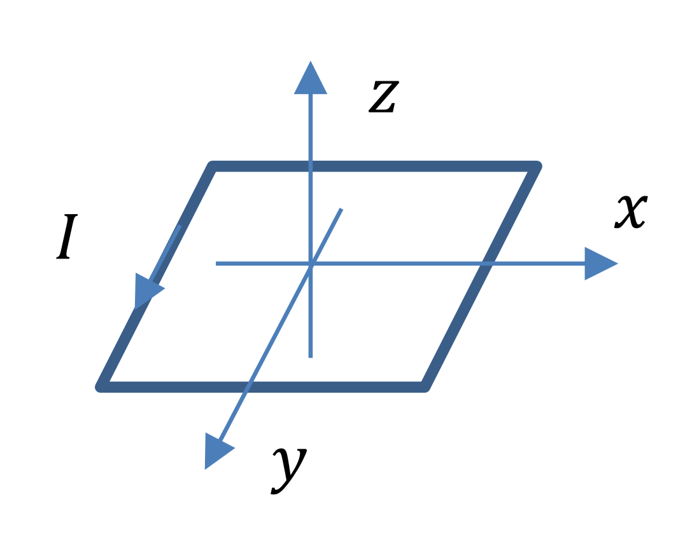
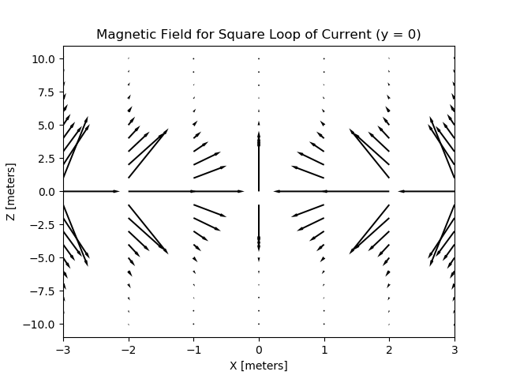
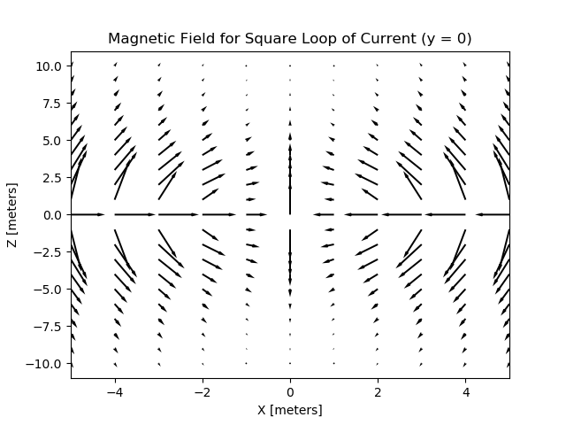

This was a computational homework assignment for Darien Wood's section of **PHYS3602: Electricity and Magnetism** in Fall 2019 at Northeastern University.

Problem:
========

Consider a square loop of current in the xy-plane with sides of length L
with its center at the origin.

**Original:** Find the magnetic field on the center axis (xy-axis) as a
function of z.\
\
**Modification:** Visualize the magnetic field on and off the center
axis for y = 0, as a function of x and z.

Code
====

The Python script calls for the user to specify length (L) and current (I) values for the calculation. It will then generate a coordinate grid for -L ≤ x ≤ L and -10 ≤ z ≤ 10 and calculates the magnetic field at each point.

Example Output
--------------
### Output with I = 2A, L = 5 meters

### Output with I = 3A, L = 3 meters

